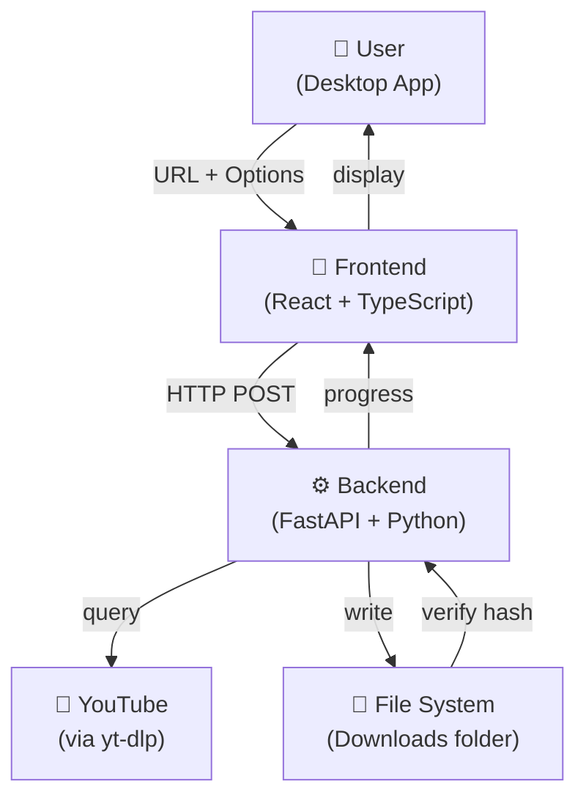

# Celeste Downloader - Architecture

## System Overview

## Components

### Frontend (React)
- **Purpose**: User interface for input, preview, progress, settings
- **Framework**: React 18 + TypeScript
- **Styling**: Tailwind CSS
- **State**: Zustand (minimal)
- **Pages**: Main, Settings, About, History

### Backend (Python)
- **Purpose**: Download orchestration, verification, yt-dlp wrapper
- **Framework**: FastAPI
- **Key functions**:
  - `GET /metadata?url=...` - Fetch video info
  - `POST /download` - Start download with SHA-256 verification
  - `WS /progress` - WebSocket for real-time progress

### yt-dlp Wrapper
- Encapsulates `yt-dlp` calls
- Validates URLs
- Handles quality selection
- Returns download metadata

### Verification Engine
- SHA-256 hash computation
- Retry logic (max 3 attempts)
- Secure storage of expected hashes

## Technology Stack

| Layer | Tech | Why |
|-------|------|-----|
| Frontend | React 18 + TypeScript | Type safety, modern UI |
| Styling | Tailwind CSS | Rapid design, consistent spacing |
| State | Zustand | Minimal, no boilerplate |
| Backend | FastAPI | Fast, async, auto OpenAPI docs |
| Download | yt-dlp | Best YouTube support |
| Verification | hashlib (SHA-256) | Standard, built-in Python |
| Packaging | PyInstaller | One-file executables |

## Key Decisions (ADRs)

### ADR-1: Why no persistent database?
- **Status**: Accepted
- **Rationale**: MVP scope, session history sufficient
- **Trade-off**: Can't restore history after restart

### ADR-2: Why Zustand over Redux?
- **Status**: Accepted
- **Rationale**: Minimal state management, simpler than Redux
- **Trade-off**: Not suited for very complex state

### ADR-3: Why FastAPI over alternatives?
- **Status**: Accepted
- **Rationale**: Async support, auto OpenAPI docs, type hints
- **Trade-off**: Python-only backends
