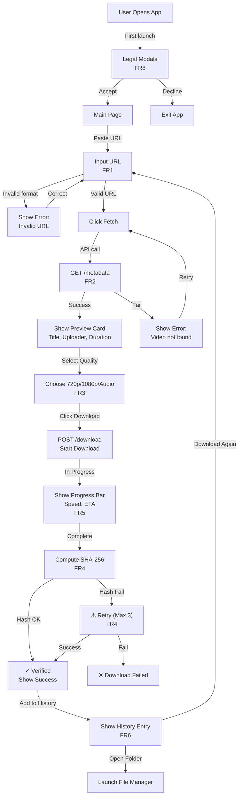
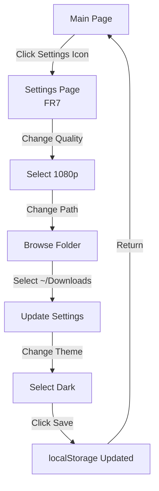
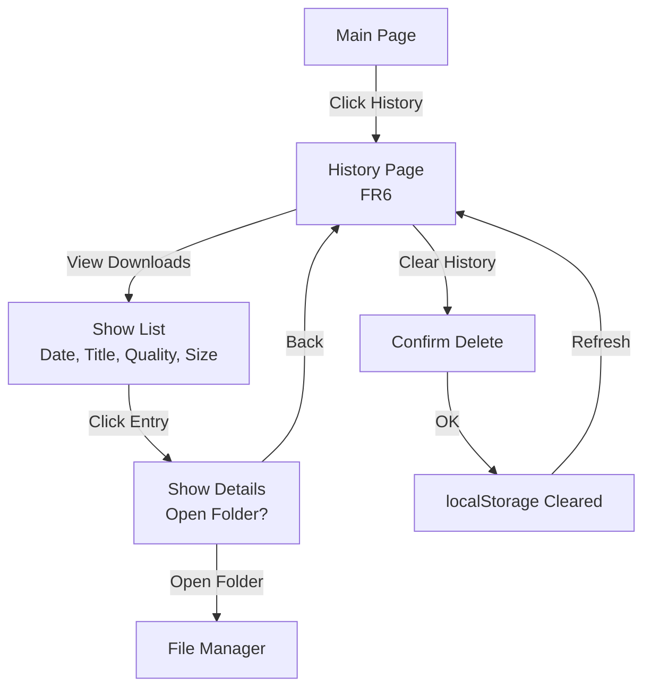
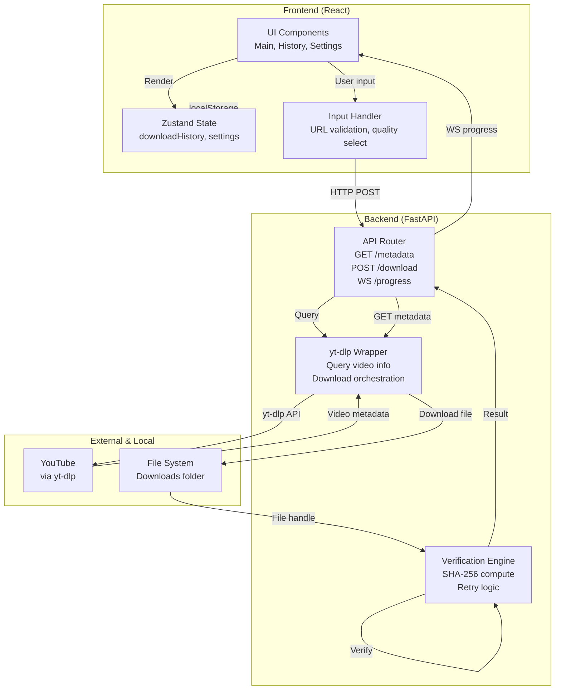

# Celeste Downloader - Design System

**Version**: v0.1.0-alpha  
**Updated**: 2026-08-17  
**Audience**: Frontend developers, UI designers

---

## Color Palette

### Semantic Colors
| Color | Hex | Usage | Light Mode | Dark Mode |
|-------|-----|-------|------------|-----------|
| Primary | `#0066FF` | Links, primary buttons, accents | ✓ | ✓ |
| Success | `#10B981` | Success states, verified badges | ✓ | ✓ |
| Error | `#EF4444` | Error messages, danger buttons | ✓ | ✓ |
| Warning | `#F97316` | Warning states, attention needed | ✓ | ✓ |
| Info | `#3B82F6` | Informational badges | ✓ | ✓ |

### Neutral Colors
| Color | Hex | Light Mode Usage | Dark Mode Usage |
|-------|-----|------------------|-----------------|
| Gray 50 | `#F9FAFB` | Page background | N/A |
| Gray 100 | `#F3F4F6` | Card background | N/A |
| Gray 300 | `#D1D5DB` | Borders, dividers | N/A |
| Gray 600 | `#4B5563` | Secondary text | N/A |
| Gray 900 | `#111827` | Primary text | N/A |
| Dark Gray | `#1A1A1A` | N/A | Page background |
| Dark Gray 800 | `#2A2A2A` | N/A | Card background |
| Dark Gray 600 | `#8B8B8B` | N/A | Secondary text |

### Accessibility
- Minimum contrast ratio: 4.5:1 for all text (WCAG AA)
- Focus indicators: `2px solid #0066FF`
- Error & success states: never color-only (include icons/text)

---

## Typography

### Font Families
- **Display**: [Inter](https://fonts.google.com/specimen/Inter) (bold, 600-700 weight)
- **Body**: Inter (regular 400, medium 500, semi-bold 600)
- **Mono**: [JetBrains Mono](https://www.jetbrains.com/lp/mono/) (12px, regular weight)

### Type Scale
| Usage | Size | Weight | Line Height | Letter Spacing |
|-------|------|--------|-------------|-----------------|
| H1 (Page Title) | 32px | Bold (700) | 1.2 | -0.5px |
| H2 (Section) | 24px | Bold (700) | 1.3 | 0px |
| H3 (Subsection) | 18px | Semi-bold (600) | 1.4 | 0px |
| Body (default) | 16px | Regular (400) | 1.5 | 0px |
| Body (small) | 14px | Regular (400) | 1.4 | 0px |
| Label (UI) | 12px | Medium (500) | 1.3 | 0.5px |
| Mono (code) | 12px | Regular (400) | 1.5 | 0px |

---

## Layout & Spacing

### Grid System
- **Base unit**: 8px (rem = base × 0.5)
- **Spacing scale**: 8, 16, 24, 32, 48, 64, 80, 96px
- **Content width**: 1200px max on desktop, full width on mobile
- **Gutter**: 24px (desktop), 16px (tablet), 12px (mobile)

### Border Radius
- **Standard**: 8px (cards, buttons, inputs)
- **Small**: 4px (tags, badges, small elements)
- **Large**: 12px (modals, elevated surfaces)

### Shadows
- **Subtle**: `0 1px 2px 0 rgba(0,0,0,0.05)`
- **Base**: `0 4px 6px -1px rgba(0,0,0,0.1), 0 2px 4px -1px rgba(0,0,0,0.06)`
- **Elevated**: `0 10px 15px -3px rgba(0,0,0,0.1), 0 4px 6px -2px rgba(0,0,0,0.05)`
- **Modal**: `0 20px 25px -5px rgba(0,0,0,0.1), 0 10px 10px -5px rgba(0,0,0,0.04)`

---

## Responsive Breakpoints

| Device | Width | Context |
|--------|-------|---------|
| Mobile | 320-480px | Phones, portrait |
| Tablet | 481-768px | iPad, landscape |
| Desktop | 769px+ | Desktop/laptop |

### Mobile-First Strategy
- Base styles: mobile (320px)
- Tablet layer: `@media (min-width: 481px)`
- Desktop layer: `@media (min-width: 769px)`

### Dark Mode
- System preference: `@media (prefers-color-scheme: dark)`
- Toggle option in Settings (overrides system)
- Tailwind: Use `dark:` prefixed classes

---

## Component States

### Buttons
```
STATE      | Background    | Text      | Border    | Cursor   | Notes
-----------|---------------|-----------|-----------|----------|-------
Default    | #0066FF       | White     | None      | pointer  | Primary action
Hover      | #0052CC       | White     | None      | pointer  | Highlight
Active      | #003D99       | White     | None      | pointer  | Pressed state
Disabled   | #D1D5DB       | #9CA3AF   | None      | not-allowed | Greyed out
Focus      | #0066FF       | White     | 2px solid #0066FF | pointer | Outline ring
```

### Text Inputs
```
STATE      | Background    | Border    | Cursor   | Notes
-----------|---------------|-----------|----------|--------
Default    | White         | #D1D5DB   | text     | Empty, ready
Focused    | White         | #0066FF   | text     | 2px border, blue outline
Filled      | White         | #D1D5DB   | text     | User entered value
Error      | #FEE2E2       | #EF4444   | text     | Invalid input, red border
Disabled   | #F9FAFB       | #E5E7EB   | not-allowed | Greyed, cannot type
```

### Progress Bar
```
STATE      | Background    | Fill      | Text      | Notes
-----------|---------------|-----------|-----------|----------
0%         | #E5E7EB       | Transparent | "0%" | Starting state
Indeterminate | #E5E7EB   | Shimmer   | "Preparing..." | Before size known
50%        | #E5E7EB       | #0066FF (50%) | "50% • 2.5 MB/s" | Mid-download
Complete   | #E5E7EB       | #10B981   | "✓ Complete" | Success state
Error      | #E5E7EB       | #EF4444   | "⚠ Failed" | Failure state
```

### Badges & Status
```
Type       | Bg             | Text      | Icon      | Example
-----------|----------------|-----------|-----------|----------
Success    | #DBEAFE        | #0369A1   | ✓         | "✓ Verified"
Warning    | #FEF3C7        | #92400E   | ⚠         | "⚠ Check Quality"
Error      | #FEE2E2        | #991B1B   | ✕         | "✕ Failed"
Info       | #DBEAFE        | #0369A1   | ℹ         | "ℹ 720p Available"
```

---

## Page Layouts

### Main Page (Download)

**Wireframe**:
```
┌─────────────────────────────────────────────────────┐
│         CELESTE DOWNLOADER                 ⚙ History│
├─────────────────────────────────────────────────────┤
│                                                      │
│  Download a Video                                   │
│  ┌──────────────────────────────────────────────┐  │
│  │ https://youtube.com/watch?v=...        [Clear] │  │ FR1
│  └──────────────────────────────────────────────┘  │
│  [Fetch Metadata]                                   │
│                                                      │
│  ┌──────────────────────────────────────────────┐  │
│  │ ▶ Video Title Here                           │  │ FR2
│  │ Uploader • 10:32 • 720p+1080p                │  │ Preview
│  │ [720p ▼] [Download]                          │  │ Card
│  └──────────────────────────────────────────────┘  │
│                                                      │
│  ┌──────────────────────────────────────────────┐  │
│  │ ████████████░░░░░░░░░ 65%                   │  │ FR5
│  │ Speed: 2.5 MB/s • ETA: 02:15 • [Cancel]    │  │ Progress
│  └──────────────────────────────────────────────┘  │ Card
│                                                      │
│  ✓ Download complete • Verified               1.2 GB│ FR4
│  [Open Folder] [Details]                           │
│                                                      │
└─────────────────────────────────────────────────────┘
```

### History Page

```
┌─────────────────────────────────────────────────────┐
│         CELESTE DOWNLOADER              Download    │
├─────────────────────────────────────────────────────┤
│ Session History                    [Clear History]  │
│                                                      │
│ # │ Date       │ Title         │ Quality │ Size    │ FR6
│───┼────────────┼───────────────┼─────────┼─────────│
│ 3 │ 14:32 today│ Video Title 1 │ 1080p   │ 245 MB │
│ 2 │ 14:15 today│ Video Title 2 │ 720p    │ 156 MB │
│ 1 │ 13:42 today│ Audio Only    │ MP3     │ 8.5 MB │
│                                                      │
└─────────────────────────────────────────────────────┘
```

### Settings Page

```
┌─────────────────────────────────────────────────────┐
│         CELESTE DOWNLOADER              Download    │
├─────────────────────────────────────────────────────┤
│ Preferences                                          │
│                                                      │
│ Default Quality                                     │
│ ◉ 720p  ○ 1080p  ○ Audio-only                      │ FR7
│                                                      │
│ Save Location                                       │
│ /Users/name/Downloads          [Browse...]         │
│                                                      │
│ Theme                                               │
│ ◉ System  ○ Light  ○ Dark                          │
│                                                      │
│ [Save] [Reset to Defaults]                         │
│                                                      │
└─────────────────────────────────────────────────────┘
```

### Legal Modals (First Launch)

```
┌────────────────────────────────────────────┐
│                                            │
│  ⓘ Important Legal Information            │
│                                            │
│  This app uses yt-dlp to download         │
│  YouTube videos. Ensure you respect       │
│  YouTube's Terms of Service and only      │
│  download content you have permission     │
│  to download.                             │
│                                            │
│  • [License Info]                         │ FR8
│  • [Full Terms]                           │
│  • [yt-dlp Attribution]                   │
│                                            │
│  ☑ I understand and accept the risks     │
│                                            │
│               [Accept] [Decline]          │
│                                            │
└────────────────────────────────────────────┘
```

---

## UX Flows (User Journeys)

### Flow 1: Happy Path (Download Video)



### Flow 2: Settings Management



### Flow 3: History Access



---

## Data Flow Diagram



---

## Interaction Details

### URL Input Debounce
- User types URL → debounce 300ms before validation
- Validation: regex check for YouTube URL format
- Feedback: "✓ Valid URL" (green) or "✗ Invalid URL" (red) in <100ms
- Accessibility: ARIA label: "Enter YouTube URL here"

### Download Progress Updates
- WebSocket updates at max 1/sec (server-side throttle)
- Progress bar interpolation: smooth transition between updates
- ETA calculation: `(remainingBytes / currentSpeed)`
- Cancel button: graceful cleanup, partial file deletion

### Error Handling
- Network error: "Check your connection" + Retry button
- Invalid URL: "Not a YouTube URL" + example
- Video not found: "Video unavailable or deleted"
- Verification fail: "Download corrupted" + Retry up to 3x
- Disk full: "Not enough space" + suggestion to change save path

---

## Accessibility (WCAG 2.1 AA)

### Keyboard Navigation
- Tab order: Input → Fetch → Quality select → Download button
- Enter: Activate primary button (Download)
- Escape: Close modals, cancel downloads
- Focus indicators: 2px blue ring, high contrast

### Screen Reader
- Page landmark: `<main role="main">`
- Button labels: "Fetch Metadata", "Download Video", not just "Go"
- Progress: `aria-valuenow="65"` updated live
- Status messages: `role="alert"` for errors/success

### Color & Contrast
- All text: minimum 4.5:1 contrast (AA standard)
- Icons always paired with text (not color-only)
- Error states: red + ✕ icon + error text

---

## Dark Mode Considerations

### Color Overrides for Dark Mode
| Element | Light | Dark |
|---------|-------|------|
| Page BG | #F9FAFB | #1A1A1A |
| Card BG | #FFFFFF | #2A2A2A |
| Text Primary | #111827 | #F3F4F6 |
| Text Secondary | #4B5563 | #8B8B8B |
| Border | #D1D5DB | #4B4B4B |
| Button Primary | #0066FF | #3B82F6 (lighter) |

### Implementation
- CSS custom properties: `--bg-primary`, `--text-primary`, etc.
- Tailwind: `dark:bg-gray-900 dark:text-white`
- Test: All text readable in both themes

---

## Performance Considerations

### Image Optimization
- Thumbnail preview: 360×202px JPEG, <50KB
- Lazy load images below fold
- Use `srcset` for responsive images

### Animation Performance
- Progress bar: use CSS transforms, not width animation
- Transitions: `transition: all 200ms ease-in-out` (smooth but not jarring)
- Avoid: complex shadow changes, filter effects during download

### Rendering
- Virtualize long history lists (500+ items)
- Memoize components: `React.memo()` on pure components
- Profile with Lighthouse before release
